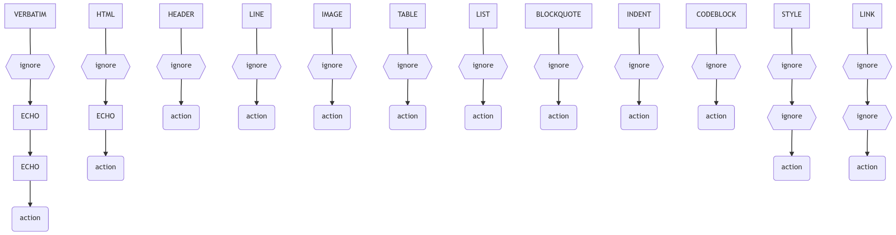

    

<h1 align="center">
md2tex</h1></h1>

       

> Creado por **Miguel Ángel Fernández Gutiérrez** (<https://mianfg.me/>) como práctica de uso de Lex para la asignatura **Modelos de Computación** (DECSAI)  
> Doble Grado en Ingeniería Informática y Matemáticas, UGR. Curso 2019/2020

**Markdown** es uno de los lenguajes de marcado más populares y útiles en el mundo de la informática, pues permite tomar apuntes de forma estilizada muy rápidamente.

Por otra parte, **LaTeX** es otro sistema de composición de textos, mucho más complejo y más lento de usar. Insertar cosas tan fundamentales como negritas, énfasis, listas, etc. puede resultar tedioso en algunas ocasiones.

**`md2tex`** es la solución para cuando queremos escribir rápidamente texto estilizado en LaTeX, pues convierte texto en Markdown a texto en LaTeX.

## Uso

### Prerrequisitos

Este programa requiere únicamente de un compilador de C. Para poder construir todas las dependencias automáticamente, puede usar la herramienta `make`.

### Ejecución

Haga uso del `makefile` proporcionado, haciendo:

~~~
$> make
~~~

Obtendrá el archivo compilado `md2tex`, que puede ejecutar sobre el archivo Markdown de prueba `example.md`:

~~~
$> ./md2tex example.md
~~~

Compruebe y compare los archivos `example.md` y el recién generado `example_md2tex.tex`.

Puede observar las fases de la traducción haciendo:

~~~
$> ./md2tex example.md --preserve
~~~

## Características del traductor

**`md2tex`** ofrece las siguientes funcionalidades:

* **Traducción.** Es capaz de traducir texto en Markdown de acuerdo a la especificación GSM (ver [_GitHub-flavored Markdown_](#github-flavored-markdown) más adelante) a texto en LaTeX. Soporta las siguientes categorías de Markdown (y una extra :wink:):
  * **HTML** (`HTML`). El traductor dejará los comandos HTML intactos.
  * **Cabeceras (h1-h6)** (`HEADER`). Incluyendo cabeceras _setext_.
  * **Línea larga** (`LINE`).
  * **Imágenes** (`IMAGE`). Inserta imágenes, así como su pie de foto.
  * **Tablas** (`TABLE`). Inserta tablas, soportando las siguientes características:
    * **Alineación.** Insertando `:` a la izquierda o derecha de los separadores de tablas se puede especificar la alineación de cada columna (de acuerdo a lo especificado en GFM).
    * **Ajuste dinámico.** En caso de que el número de columnas de cada fila sea diferente, `md2tex` rellenará la fila con columnas vacías hasta llegar al número de columnas máximo de la tabla, para evitar errores de renderización en LaTeX.
  * **Listas _itemize_** (`LIST`).
  * **Listas _enumerate_** (`LIST`). Soportando, además, las siguientes características:
    * **Comienzo inteligente.** En caso de que la lista numerada comience en 1, no se insertarán directivas adicionales en LaTeX. Si comienza en un número mayor que 1, se insertará una directiva adicional en LaTeX indicando el comienzo de la lista en ese número.
    * **Corrección de desajustes.** El traductor es capaz de comprender el orden de las listas, incluyendo directivas extra en `\item` para los elementos que no sigan dicho orden.
  * **Citas (_blockquotes_)** (`BLOCKQUOTE`).
  * **Indentación** (`INDENT`).
  * **Bloques de código** (`CODEBLOCK`). Soportando, además, el _syntax highlighting_ (el lenguaje especificado para el bloque en Markdown será insertado en la traducción).
  * **Estilización** (`STYLE`) con negritas, énfasis, ambos, tachado y código _inline_.
  * **Enlaces** (`LINK`). Guardando el texto y la URL en la traducción.
  * ***Escaping.*** Permite que la inserción de una barra invertida `\` sobre caracteres que pueden conllevar comandos renderice el caracter adyacente sin efecto sobre los hipotéticos comandos localizables sin dicha barra invertida.
  * **_Verbatim_** (`VERBATIM`). El código insertado entre `$$` será colocado tal cual en la traducción, eliminando los `$$` que lo rodean. Esto es útil, por ejemplo, si queremos insertar comandos de LaTeX directamente en Markdown.
* **Customización de comandos LaTeX.** Debido a que, en la mayoría de las ocasiones, el usuario tiene una serie de comandos que usa por su cuenta, `md2tex` hace uso de un fichero de cabecera de C, llamado `latexcommands.h`, modificable por el usuario. El fichero está exhaustivamente especificado para poder sustituir los comandos predeterminados por los comandos que el usuario desee.

### Sobre la traducción

Debido a las dependencias entre los distintos comandos de Markdown, y a la posibilidad de anidación entre ellos, estos se ejecutan en cuatro fases de traducción.

1. **_Escaping_ I.** Sustituye las cadenas de caracteres escapados a cadenas seguras que no pueden ser interpretadas como comandos.
2. **Bloques.** Sustituye los bloques principales.
3. **Estilización.** Sustituye los comandos estilísticos.
4. **_Escaping_ II.** Sustituye las cadenas escapadas por los caracteres originales.

Debido a la forma y la preferencia de `lex` en el _parsing_ de los caracteres, se recurre en algunos comandos a la estrategia de parsear con `ECHO`, es decir, de "leer" esa secuencia de caracteres y no hacer nada. Como `lex` ejecuta la regla sobre la cadena más larga, si se encuentran otros comandos dentro de la cadena parseada, serán ignorados. Podemos usar esto en nuestro beneficio, aunque también nos impone [algunas limitaciones](#limitaciones-técnicas-y-posibles-mejoras).

A continuación, un grafo explicando qué comandos se _parsean_ en cada fase de traducción. Considere [las etiquetas mencionadas anteriormente](#), y las siguientes estrategias:

* **ignore:** no parsear.
* **ECHO:** parsear y `ECHO`.
* **action:** se modifica el texto de alguna forma.

Cada flecha significa _fase siguiente_, comenzando por la primera fase.

### Consideraciones importantes

#### GitHub-flavored Markdown

Debido a que no hay un estándar para renderizar texto Markdown, para este traductor se ha tenido en cuenta la especificación [GitHub-flavored Markdown](https://github.github.com/gfm/). Ésta consiste en más de seiscientas reglas y ejemplos.

Este traductor es capaz de traducir la mayor parte de estas reglas, excepto algunas de ellas por dos motivos:

* Son reglas "inútiles" (la mayoría de los _parsers_ no la tienen implementada).
* No son reglas interpretables por expresiones regulares (y, por ello, por lenguajes regulares).

#### Limitaciones técnicas y posibles mejoras

Debido a limitaciones de `lex` (y a que sería muy complicado implementarlo en este lenguaje), las siguientes características no funcionan de forma total en el traductor:

* Anidamiento de estilos: si queremos colocar una cursiva en una negrita, por ejemplo. Puede evitarse concatenando los estilos.
* Múltiples niveles en listas: el traductor sólo es capaz de interpretar listas un nivel de profundidad.
* Estilos en textos de enlaces e imágenes: podría implementarse con una fase extra en la traducción. Lo he considerado innecesario.

Estas características podrían implementarse en futuras versiones de la aplicación.

## Ficheros

| Nombre de fichero | Descripción |
| --- | --- |
| [`defines.h`](./defines.h) | `#define` necesarios para el _lexer_, hacen el código más claro y estético |
| [`example.md`](./example.md) | Ejemplo que usa casi todas las etiquetas Markdown |
| [`example_md2tex.tex`](./example_md2tex.tex) | Output de ejecutar `md2tex` sobre el ejemplo anterior |
| [`latexcommands.h`](./latexcommands.h) | Permite la customización de los comandos LaTeX (ver [_Características del traductor_](#características-del-traductor)) |
| [`lex.yy.c`](./lex.yy.c) | Es el fichero generado al hacer `lex md2tex.l`, lo inserto aquí en caso de que este comando no funcione correctamente |
| [`makefile`](./makefile) | Facilita la compilación |
| [`md2tex_main.c`](./md2tex_main.c) | Contiene el `main`, llama a `m2tex.l` (traducido a C) y genera archivos para cada fase de la traducción |
| [`md2tex.l`](./md2tex.l) | El fichero de `lex`, es el que contiene el código relativo a la traducción de cada fase |
